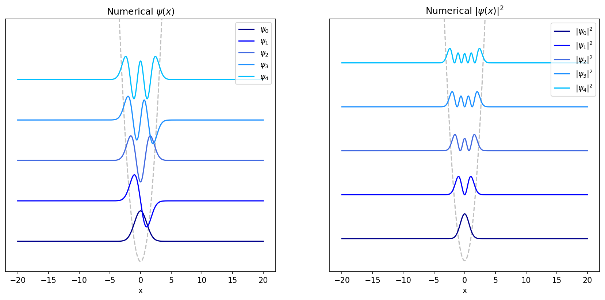
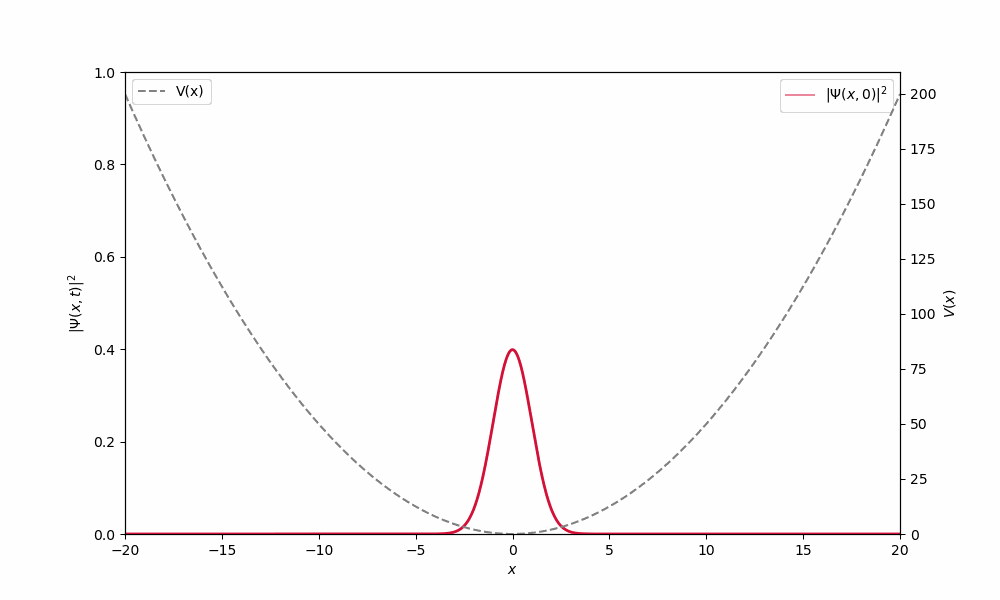
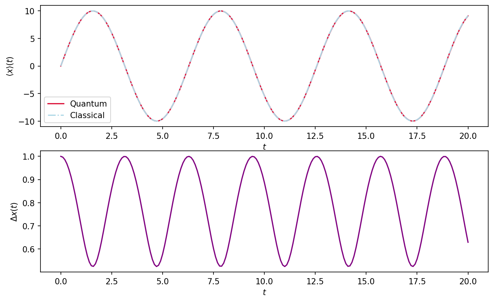

# Quantum Harmonic Oscillator Simulation
Numerical approximation of TISE and TDSE for quantum harmonic oscillator, extending to Gaussian wavepacket evolution. Error analysis of finite differences method and domain width used. 

## Project overview
This project involves finding solutions of the time-independent Schrodinger Equations for a 1D harmonic potential using the central difference method, from the family of finite difference methods. The absolute error in the numerically determined $E_n$ (compared to the analytical $E_n$) is considered. This permits analysis of errors including 
- Roundoff error
- Truncation error
- Error due to the chosen domain width
This error analysis justifies the chosen parameter values dx, L and N.

Next, a Gaussian wavepacket at the equilibrium position with non-zero initial momentum is constructed by superposing the numerically determined eigenstates. The time-dependent wavepacket dynamics are considered, and the wavepacket is identified as a 'squeezed state' of the QHO. 

## Method
For the QHO system, where $\hat{V}(x) = \frac{1}{2} m\omega^2x^2$, the Schrodinger equation is separable. To numerically solve the TISE $\hat{H}\psi(x) = E\psi(x)$, where $\hat{H} = -\frac{\hbar^2}{2m} \frac{\partial^2 \psi(x)}{\partial x^2} + \frac{1}{2} m\omega^2 x^2 \psi(x)$, $\hat{H}$ is approximated by the $N \times N$ matrix 

$$\hat{H} \approx
\begin{pmatrix} 
    \frac{\hbar^2}{m} + \frac{1}{2}m \omega^2 x_0^2 & -1 & 0 & \cdots & 0 \\
    -1 & \frac{\hbar^2}{m} + \frac{1}{2}m \omega^2 x_1^2 & -1 &\cdots & 0 \\
    \vdots & \vdots & \ddots & \vdots & \vdots \\
    0 & 0 & \cdots & -1 & \frac{\hbar^2}{m} + \frac{1}{2}m \omega^2 x_{N-1}^2 
\end{pmatrix}$$

The central differences method approximates the second derivative of a function $f(x)$ at a point $x_i$ as $$f''(x_i) = \frac{f(x_i + dx) - 2f(x_i) + f(x_i - dx)}{(dx)^2}$$, where $dx$ is the step size between $x_i$ and $x_{i+1}$, hence the ease of the matrix approximation for $\hat{H}$. In the case of $\hat{H}$, $N = 4000$ and $dx = 0.01$, so the domain width $L = 40$.

The eigenpairs of $\hat{H}, \{ E_n, \psi_n(x) \},$ are found using `eigh`. 

Evaluation of the absolute error in $E_{n,\text{num}}$ sees significant increases in error for increasingly energetic eigenstates, despite the error remaining consistently small for the lowest energy eigenstates. Considering the dependence of the roundoff and truncation error establishes a baseline for the error inherent in the central differences method, hence the minimum error in $E_{n,\text{num}}$ for all n. This error is dependent only on $dx$ and is independent of $n$ so is eliminated as a possible source for the increase in absolute error in $E_{n,\text{num}}$ with $n$. Hence, error due to the domain width, which arises as the $\hat{H}$ approximation arbitrarily forces every eigenstate to equal 0 at the domain boundaries, is quantified. This shows an $n$ dependence and causes errors greater than the baseline error for $n > 80$ for $L = 40$. Therefore, the increase in absolute error in $E_{n,\text{num}}$ is attributed to the domain width. 

A Gaussian wavepacket for the QHO at time $t = 0$ is given by

$$\Psi(x,0) = \Big( \frac{1}{2\pi\sigma^2} \Big)^{\frac{1}{4}}e^{-\frac{(x - x_0)^2}{4\sigma^2}}e^{i(k_0(x - x_0))} = \sum_n c_n \psi_n(x) $$ 

where $\sigma$ is the initial spread, $x_0$ is the initial centre position and $k_0$ is the initial momentum of the wavepacket. The coefficients 

$$c_n = \sum_i \psi^*_n(x_i) \Psi(x_i, 0) dx$$ 

are calculated to construct the wavepacket for this system. 

Solutions to the TDSE $i\hbar \frac{\partial \phi(t)}{\partial t} = E\phi(t)$ are of the form $e^{\frac{-iE_nt}{\hbar}}$ for all $n$. Hence $\Psi(x,0)$ evolves in time as 

$$\Psi(x_i,t_j) = \sum_n c_n\psi_n(x_i)e^{\frac{-iE_nt_j}{\hbar}}$$  

Only eigenstates $n = 0$ to $n = 80$ are used to construct $\Psi(x,t)$ as errors introduced into $\psi_n$ for $n > 80$ due to the domain width causes erroneous dispersion of $\Psi(x,t)$. 
Finally, the expectation and uncertainty in the position $x$ of the wavepacket are calculated using

$$ \langle x \rangle (t_j) = \langle \Psi(x,t_j)|\hat{X}|\Psi(x,t_j)\rangle \approx \sum_i |\Psi(x,t_j)|^2 x_i dx $$
and
$$ \Delta x(t_j) = \sqrt{\langle x^2 \rangle (t_j) - \langle x \rangle ^2 (t_j)} $$ 

where $\hat{X} = x$. 

## Results

The first five eigenstates $\psi_n(x)$ and the corresponding probability densities $|\psi_n(x)|^2$ of the QHO with the $\hat{H}$ approximation for $-20 < x < 20$.

  

Time-dependent spatial oscillation of the probability density of a Gaussian wavepacket in a harmonic potential with $x_0 = 0, k_0 = 10$ and $\sigma = 1$.

  

The sinusoidal oscillation of $\langle x \rangle$ with $t$ with period $T = 6.25$ and the oscillation of $\Delta x(t)$ with a period half that of $\langle x \rangle (t)$.

## Repository Structure
This repository contains:
- This README
- 'plots' file: Contains the plots shown in this README
- 'Quantum_Harmonic_Oscillator.ipynb' Jupyter notebook: This jupyter notebook contains all of the code for the calculations, error analysis and plots (including additional plots not included in the README) required for this project. This is supplemented with extensive markdown, explaining and commenting on the underlying theory, justifications for steps, error analysis and interpretations of the results displayed.  [View the notebook](Quantum_Harmonic_Oscillator.ipynb) 
